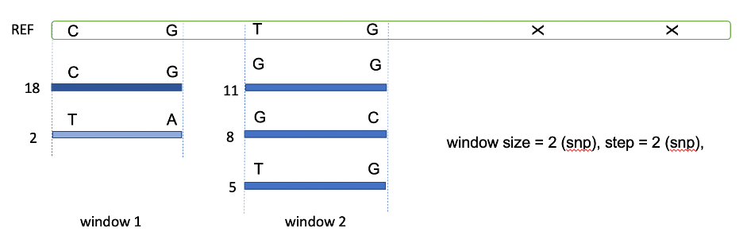
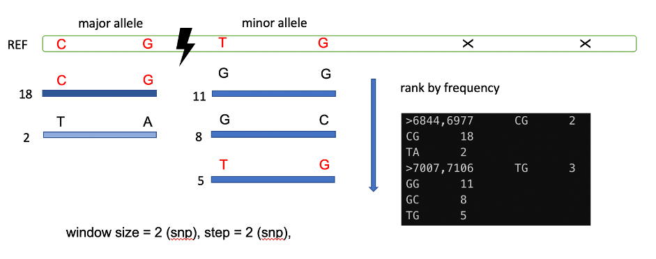

### Strategy to identify chimeric region in marmoset assembly

We utilized SNV phasing information identify all the possible alleles for each individual (offspring, mother, father). We performed in a non-overlapping sliding-window way for each genomic region spanning 2 SNVs. In this genome, the N50 size of genomic region spanning 2 SNVs is 2.8 kb. In principle, for each 2 SNVs window, we should maximally detect four potential alleles. The analysis in offspring was based on 10X-linked reads, while mother and father samples were based on their Illumina resequencing reads (PE151). 

Each allele represented one unique combination genotype of the two SNVs (Fig. 1). We calculate the number of reads support for each allele. And base on the raking of the number for each allele, the top two alleles are considered as major alleles and the rest two are minor alleles. Thus, windows are assigned as chimeric if there contain more than two allele types.


Figure 1. Diagram of allele detection process. Each window spans two SNVs. The number on the left of blue line represents the number of supported reads for each allele genotype. In this case, window 1 have two alleles and window 2 contain three alleles. 


During the trio-binning process, some of the Pacbio reads derived from the minor alleles might be selected as parental specific alleles thus were used in the assembly process. In principle, these reads will have lower chance to be assembled because of the low-depth sequencing. However, because the PCR and sequencing process is evenly distributed between alleles, it is possible that some of the minor alleles can be sequenced in relative high depth thus can be used in assembly. We next estimate how much proportion of the assembly mixed with major alleles and minor alleles by mapping the paternal and maternal assemblies to the phasing alleles (Fig. 2). If the genotype in the assembly is similar with the genotype of major allele, we consider the genomic regions were derived from major alleles. 


```shell
repeat="xxx/chimera/offspring/mCalJac1.TRF.chr.gff"
bin="marmoset/Chimerism"
cat ../chr.list|while read a
do
	[ -d $a ] || mkdir $a
	cd $a
	[ -e $a.bam ] || ln -s GATK_10X/$a/$a.bam
	[ -e $a.bam.bai ] || ln -s GATK_10X/$a/$a.bam.bai
	[ -e $a.snp.vcf.gz ] || ln -s GATK_10X/$a/$a.snp.vcf.gz
	tabix $a.snp.vcf.gz
	software/Genome/gatk-4.1.4.1/gatk VariantFiltration -V $a.snp.vcf.gz --filter-expression \"QD < 2.0 || MQ < 50.0 || FS > 60.0 || SOR > 3.0 || MQRankSum < -12.5 || ReadPosRankSum < -8.0\" --filter-name \"Filter\" -O $a.snp.filter.vcf.gz
	software/Genome/gatk-4.1.4.1/gatk --java-options \"-XX:ParallelGCThreads=10 -Xmx60g \" VariantsToTable -V=$a.snp.vcf.gz -F CHROM -F POS -F TYPE -F REF -F ALT -F FILTER -GF GT -GF AD -GF DP -GF GQ -GF PL -O=$a.genotype.tab --show-filtered
	grep -v 'CHROM' $a.genotype.tab|awk '\$9 > 10'  >$a.genotype.fil.tab
	awk '\$1==\"mat_${a}\"' $repeat |cut -f 1,4,5 >$a.repeat.bed
	awk '{print \$1\"\\t\"\$2\"\\t\"\$2}' $a.genotype.fil.tab > $a.genotype.fil.bed
	bedtools subtract -a $a.genotype.fil.bed -b $a.repeat.bed >$a.genotype.fil.bed.rmask
	python3 getLine_by_ColumnInTab.py $a.genotype.fil.tab 2 $a.genotype.fil.bed.rmask 2 >$a.genotype.fil.tab.rmask
	python3 $bin/extract_snp_reads.py $a.genotype.fil.tab.rmask $a.bam >$a.genotype.all.reads
	
	python3 $bin/phase_10x.step.py $a.genotype.all.reads 2 2 >$a.genotype.all.reads.2_2.alleles
	
	python3 $bin/statistic_subtype_alleles_nostep.py $a.genotype.all.reads.2_2.alleles >$a.genotype.all.reads.2_2.alleles.info
	python3 $bin/check_assmbly_switch.py $a.genotype.all.reads.2_2.alleles > $a.genotype.all.reads.2_2.alleles.assembly.stat
	python3 $bin/statistic_assembly_stat.py $a.genotype.all.reads.2_2.alleles.assembly.stat > $a.genotype.all.reads.2_2.alleles.assembly.stat.info

	cd ..
done
```

then check the result, (chr1 as example)

```bash
head Chr1.genotype.all.reads.2_2.alleles.assembly.stat
```

```text
#block	snps	allele_type	ref_allele	ref_count	ref_rate	ref_corrected_rate	note
298-429	(298,429)	2	CA	9	0.7500	0.7500	major
1722-1723	(1722,1723)	2	GG	24	0.6486	0.6486	major
1849-2099	(1849,2099)	2	TG	5	0.6250	0.6250	major
2967-2997	(2967,2997)	3	CG	47	0.8545	0.8545	major
3071-3090	(3071,3090)	3	TA	23	0.6389	0.6389	major
3142-3216	(3142,3216)	4	GT	13	0.4194	0.4194	major
3742-4181	(3742,4181)	2	AC	1	0.5000	0.5000	major
4656-5221	(4656,5221)	1	AT	0	0.0000	0.0000	sequencing_err
5233-5253	(5233,5253)	3	GT	67	0.9054	0.9054	major
```